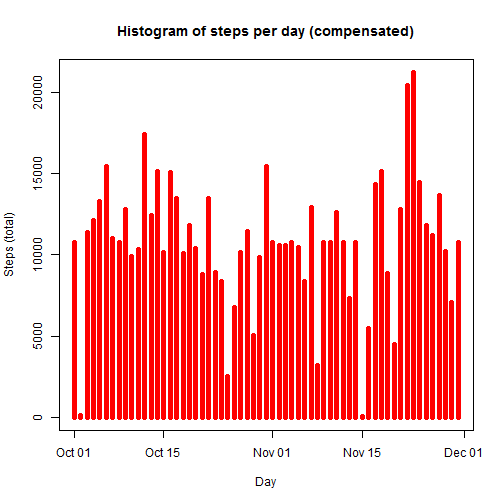

# Reproducible Research: Peer Assessment 1


## Loading the data

```r
file.location<-paste(getwd(),"/activity.csv", sep="")
activity<-read.csv(file.location, header=TRUE, colClasses=c("integer", "Date", "integer"))
```

## What is mean total number of steps taken per day?


```r
library(dplyr)
```


```r
daily.activities<-select(activity, 2:1)
steps.per.day<-aggregate(daily.activities$steps, by=list(daily.activities$date), FUN=sum)
names(steps.per.day)<-c("date", "steps")
mean.per.day<-mean(steps.per.day$steps, na.rm=TRUE)
median.per.day<-median(steps.per.day$steps, na.rm=TRUE)
plot(y=steps.per.day$steps, type="h", x=steps.per.day$date, ylab="Steps (total)", xlab="Day", lwd=5, col="red", main="Histogram of steps per day")
```

 

The daily average is 1.0766189\times 10^{4}. 
The daily median is 10765.  


## What is the average daily activity pattern?


```r
interval.activities<-select(activity, -2)
interval.activities<-na.exclude(interval.activities)
steps.per.interval<-aggregate(interval.activities$steps, by=list(interval.activities$interval), FUN=mean)
names(steps.per.interval)<-c("interval", "steps")
plot(y=steps.per.interval$steps, type="l", x=steps.per.interval$interval, ylab="Steps (average)", xlab="Interval (x5min)", lwd=1, col="blue", main="Average daily pattern")
```

 

```r
max.interval<-steps.per.interval$interval[steps.per.interval$steps==max(steps.per.interval$steps)]
```

The most active interval was 835.

## Imputing missing values


```r
missing.data<-sum(is.na(activity))
```
The number rows with NAs was 2304.


Filling in the data by adding previously calculated means for every interval instead of NA.

```r
na.activity<-filter(activity, is.na(steps))
compensated.activity<-left_join(select(na.activity, 2:3), steps.per.interval, by="interval")
compensated.activity <- select(compensated.activity, c(3,1,2)) 
compensated.activity<-rbind(compensated.activity, filter(activity, !is.na(steps)))

compensated.daily.activities<-select(compensated.activity, 2:1)
compensated.daily.activities <- arrange(compensated.daily.activities, date)
compensated.steps.per.day<-aggregate(compensated.daily.activities$steps, by=list(daily.activities$date), FUN=sum)
names(compensated.steps.per.day)<-c("date", "steps")
compensated.mean.per.day<-mean(compensated.steps.per.day$steps, na.rm=TRUE)
compensated.median.per.day<-median(compensated.steps.per.day$steps, na.rm=TRUE)
plot(y=compensated.steps.per.day$steps, type="h", x=compensated.steps.per.day$date, ylab="Steps (total)", xlab="Day", lwd=5, col="red", main="Histogram of steps per day (compensated)")
```

 

The *compensated* daily average is 1.0766189\times 10^{4}. The *compensated* daily median is 1.0766189\times 10^{4}.


```r
difference.mean.per.day<-compensated.mean.per.day-mean.per.day
difference.median.per.day<-compensated.median.per.day-median.per.day
```

The difference in daily averages is 0.
The difference in daily medians is 1.1886792

## Are there differences in activity patterns between weekdays and weekends?
Yes, we can see some differences on the plot - the main difference seems to be that the active period occurs earlier on weekdays.

```r
week.days<-c("Monday","Tuesday", "Wednesday","Thursday","Friday")
week.ends<-c("Saturday","Sunday")
patterns.activity<-mutate(compensated.activity, days=factor(weekdays(date)))

week.days.activity<-subset(patterns.activity, days %in% week.days)
week.days.steps.per.interval<-aggregate(week.days.activity$steps, by=list(week.days.activity$interval), FUN=mean)
names(week.days.steps.per.interval)<-c("interval", "mean")

week.ends.activity<-subset(patterns.activity, days %in% week.ends)
week.ends.steps.per.interval<-aggregate(week.ends.activity$steps, by=list(week.ends.activity$interval), FUN=mean)
names(week.ends.steps.per.interval)<-c("interval", "mean")

par(mfrow=c(2,1))
plot(y=week.ends.steps.per.interval$mean, type="l", x=week.ends.steps.per.interval$interval, ylab="Steps (average)", xlab="Interval (x5min)", lwd=1, col="blue", main="weekend")
plot(y=week.days.steps.per.interval$mean, type="l", x=week.days.steps.per.interval$interval, ylab="Steps (average)", xlab="Interval (x5min)", lwd=1, col="green", main="weekday")
```

 

